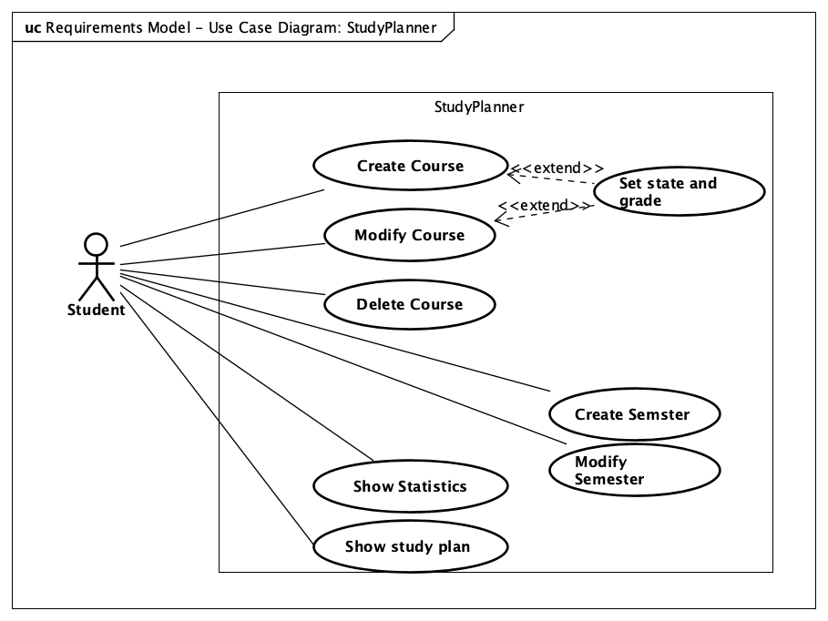
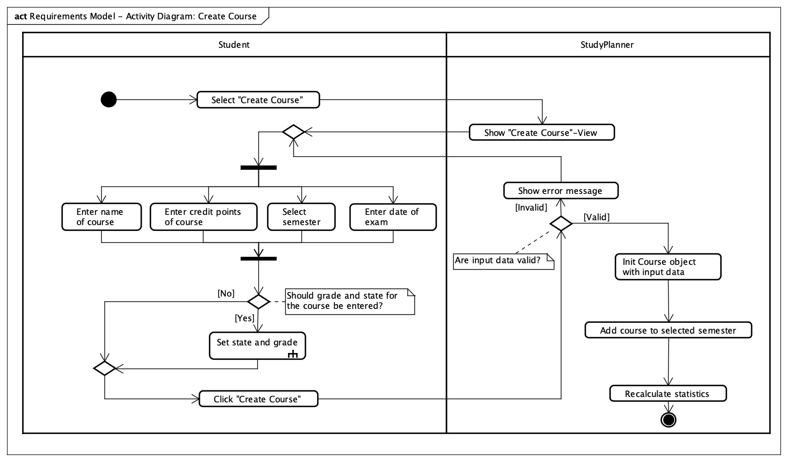
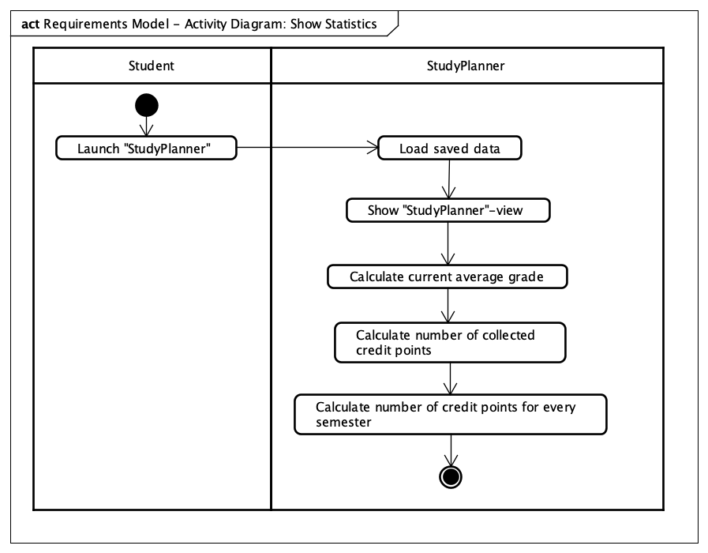
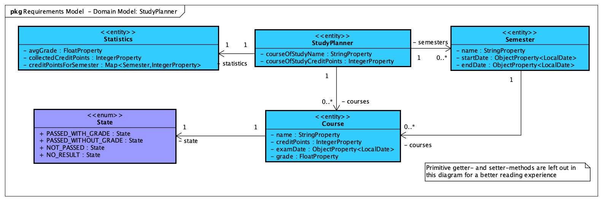
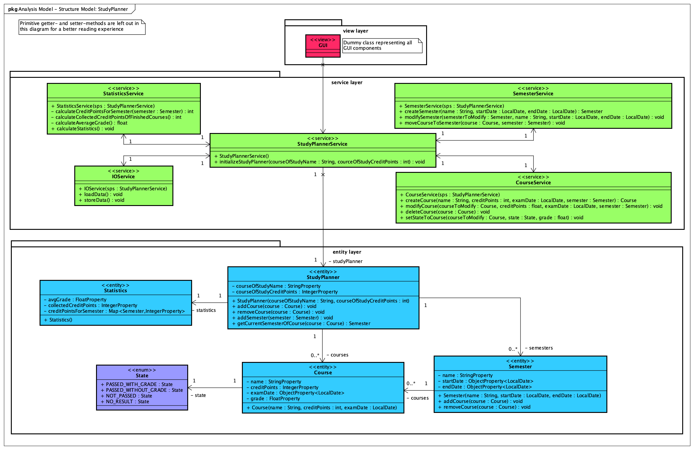
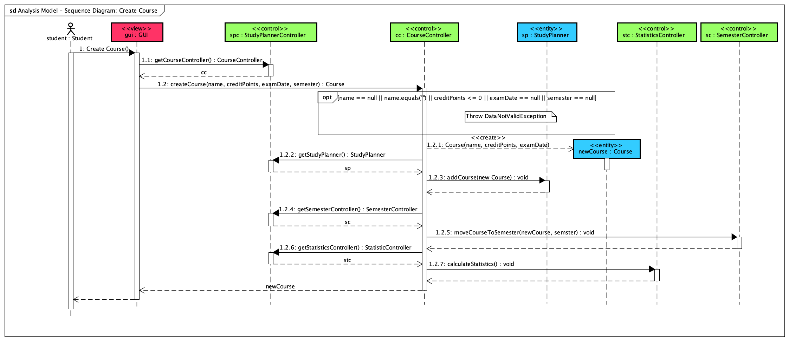
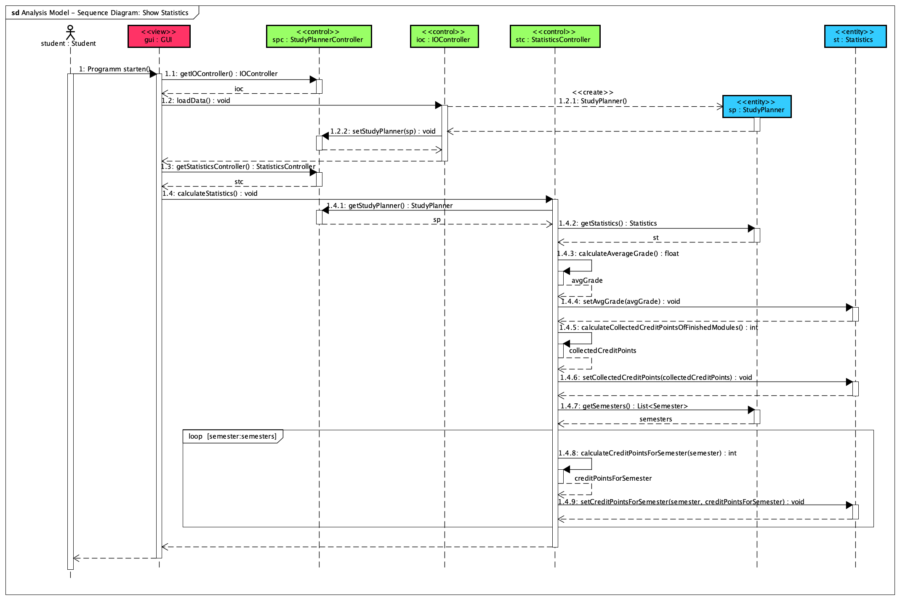
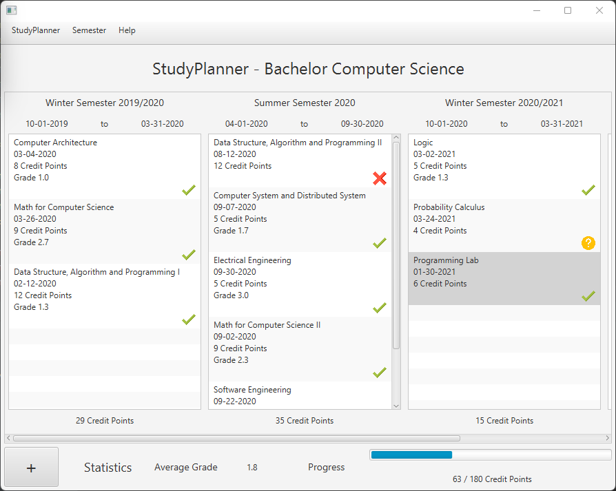
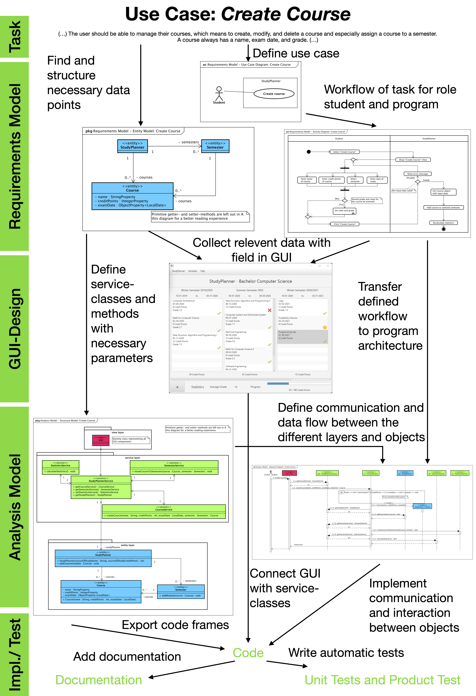

# Worked-out Example: StudyPlanner 
In this worked-out example, we present parts of the solution for the project _StudyPlanner_. The program _StudyPlanner_ is a software management tool that supports students to plan their curriculum and provides statistics about the progress and average grade.

An extended description of the project's requirements can be found in the task text below.

## Task Text
The task is to develop a software management tool for planning a curriculum. The user should be able to manage their courses, which means to create, modify, and delete a course and especially assign a course to a semester. 
A course always has a name, exam date, and grade.
For the planning of the remaining curriculum, the toll should provide statistical data like the number of credit points for a semester, the number of collected credit points, and the current average grade.
The program must store all entered data and load them when the program is launched.

## Requirement Model

 
### Use Case Diagram

### Activity Diagrams
- Activity Diagram 1: Create Course 
- Activity Diagram 2: Show Statistics 

### Domain Model

## Analysis Model
 
### Structure Model

### Sequence Diagrams
- Sequence Diagram 1: Create Course 
- Sequence Diagram 2: Show Statistics 

### Product Description (only available in German)

[Produktbeschreibung_StudyPlanner.pdf](docs/images/Produktbeschreibung_StudyPlanner.pdf)
 
## Design Model / Javadoc (only available in German)

The documentation of the program code with Javadoc can be found [here](https://sopra-ci.cs.tu-dortmund.de/studyplanner/javadoc/).

 
## Unit Tests / Test Documentation (only available in German)
The documentation of the unit tests code with Javadoc can be found [here](https://sopra-ci.cs.tu-dortmund.de/studyplanner/testjavadoc/).

## Product test (Partial)

### Example for a product test for the use case _Create Course_
| Use Case  | Create Course |
| ------ | ------ |
| Commit-Hash | f27f695ae5a37399354f0af44d80d9bfe7201b54 |
| Expected result | After creating a new course it exists a new course with the given input data|
| Needed inputs | Name, creadit points, and date of the exam of the course and the semester in which the course will be visited|
| Special cases | Invalid inputs like empty course name and credit points less than 1 are not possible. An error message is displayed in this case.
| Errors | none | 
| Test result | ✓ |
 
## The finished product

## The whole process as an overview
### Example 1: Create Course

### Example 2: Show Statistics

The program can be downloaded from the repository at branch **main**.

Repository Link: https://github.com/tudo-aqua/study-planner.git
